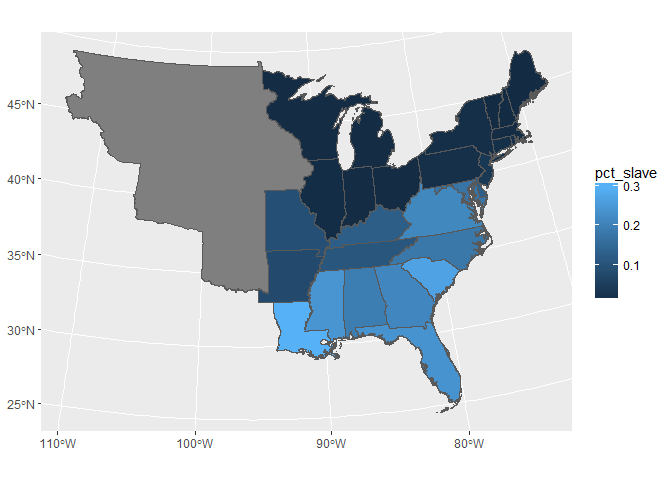
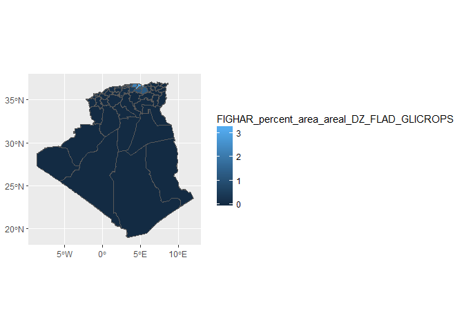

<!-- README.md is generated from README.Rmd. Please edit that file -->
ipumsimport
===========

The ipumsimport package helps import IPUMS extracts from the [IPUMS website](https://www.ipums.org) into R.

It can be installed by running the following commands:

``` r
if (!require(devtools)) install.packages("devtools")

if (Sys.info()$sysname == "Windows") {
  devtools::install_local("Z:/personal/gfellis/ipumsimport")
} else {
  devtools::install_local("/pkg/ipums/personal/gfellis/ipumsimport")
}
```

Examples
--------

``` r
library(ipumsimport)
library(haven)
library(ggplot2) # ggplot2 version > 2.2.1 (development version as of 8/1/2017)
library(dplyr)
#> 
#> Attaching package: 'dplyr'
#> The following objects are masked from 'package:stats':
#> 
#>     filter, lag
#> The following objects are masked from 'package:base':
#> 
#>     intersect, setdiff, setequal, union

# Can't share extracts in repo, so examples will only work on MPC computers
mpc_root <- function(...) {
  root <- if (Sys.info()[["sysname"]] == "Windows") "//files.pop.umn.edu/ipums/" else "/pkg/ipums/"
  paste0(root, ...)
}
```

### CPS - Hierarchical Data

Relies on user downloading the .xml DDI file and the .dat/.dat.gz file (doesn't need to be unzipped).

``` r
# Use example file included with package:
cps_hier_file <- ipumsimport_example("cps_00010.xml")
data <- read_ipums_micro(cps_hier_file)
#> Users of IPUMS-CPS data must agree to abide by the conditions of use. A user's license is valid for one year and may be renewed.  Users must agree to the following conditions:
#> 
#> (1) No fees may be charged for use or distribution of the data.  All persons are granted a limited license to use these data, but you may not charge a fee for the data if you distribute it to others.
#> 
#> (2) Cite IPUMS appropriately.  For information on proper citation,  refer to the citation requirement section of this DDI document.
#> 
#> (3) Tell us about any work you do using the IPUMS.  Publications, research  reports, or presentations making use of IPUMS-CPS should be added to our  Bibliography. Continued funding for the IPUMS depends on our ability to  show our sponsor agencies that researchers are using the data for productive  purposes.
#> 
#> (4) Use it for GOOD -- never for EVIL.
#> 
#> Publications and research reports based on the IPUMS-CPS database must cite it appropriately. The citation should include the following:
#> 
#> Sarah Flood, Miriam King, Steven Ruggles, and J. Robert Warren. Integrated Public Use Microdata Series, Current Population Survey: Version 5.0 [dataset]. Minneapolis, MN: University of Minnesota, 2017. https://doi.org/10.18128/D030.V5.0
#> 
#> The licensing agreement for use of IPUMS-CPS data requires that users supply us with the title and full citation for any publications, research reports, or educational materials making use of the data or documentation. Please add your citation to the IPUMS bibliography: http://bibliography.ipums.org/
#> 
#> Reading data...
#> Parsing data...

cat(ipums_var_desc(data, MONTH))
#> MONTH indicates the calendar month of the CPS interview.
table(as_factor(data$MONTH, levels = "both"))
#> 
#>   [1] January  [2] February     [3] March     [4] April       [5] May 
#>             0             0          3385             0             0 
#>      [6] June      [7] July    [8] August [9] September  [10] October 
#>             0             0             0             0             0 
#> [11] November [12] December 
#>             0             0
```

### CPS - Rectangular Data

Relies on user downloading the .xml DDI file and the .dat/.dat.gz file (doesn't need to be unzipped).

``` r
# Use example file included with package
cps_rect_file <- ipumsimport_example("cps_00006.xml")
data <- read_ipums_micro(cps_rect_file, verbose = FALSE)

# Can get convenient display of variable information
ipums_view(ipums_var_info(data))
```

### NHGIS

Relies on user downloading the csv file (with or without header row) and shape files (doesn't need to be unzipped).

``` r
data <- read_nhgis(
  mpc_root("personal/gfellis/ipumsimport_examples/nhgis/nhgis0005_csv.zip"),
  mpc_root("personal/gfellis/ipumsimport_examples/nhgis/nhgis0005_shape.zip"),
  matches("state"),
  verbose = FALSE
)

data <- data %>%
  mutate(pct_slave = (ABO003 + ABO004) / (ABO001 + ABO002 + ABO003 + ABO004 + ABO005 + ABO006))

ggplot(data = data) + 
  geom_sf(aes(fill = pct_slave))
```



Block level census data (Data from Alaska and Arizona)

``` r
data <- read_nhgis(
  mpc_root("personal/gfellis/ipumsimport_examples/nhgis/nhgis0006_csv.zip"),
  mpc_root("personal/gfellis/ipumsimport_examples/nhgis/nhgis0006_shape.zip")
)
#> Use of NHGIS data is subject to conditions, including that publications and research which employ NHGIS data should cite it appropiately. Please see www.nhgis.org for more information.
#> 
#> 
#> 
#> Reading data file...
#> Reading geography...
#> There are 3 rows of data that have data but no geography. This can happen because:
#>   Shape files do not include some census geographies such as 'Crews of Vessels' tracts that do not have a defined area
#>   Shape files have been simplified which sometimes drops entire geographies (especially small ones).

table(data$STATE)
#> 
#>  Alaska Arizona 
#>    9795   59674
```

### NHGIS - Change over time

Currently tested with the file type "years by column"

``` r
data <- read_nhgis(
  mpc_root("personal/gfellis/ipumsimport_examples/nhgis/nhgis0007_csv.zip"),
  mpc_root("personal/gfellis/ipumsimport_examples/nhgis/nhgis0007_shape.zip"),
  verbose = FALSE
)

data
#> Simple feature collection with 3273 features and 27 fields
#> geometry type:  MULTIPOLYGON
#> dimension:      XY
#> bbox:           xmin: -7115208 ymin: -1685018 xmax: 3321632 ymax: 4591848
#> epsg (SRID):    NA
#> proj4string:    +proj=aea +lat_1=29.5 +lat_2=45.5 +lat_0=37.5 +lon_0=-96 +x_0=0 +y_0=0 +datum=NAD83 +units=m +no_defs
#> # A tibble: 3,273 x 28
#>    STATEFP10 COUNTYFP10 COUNTYNS10 GEOID10          NAME10
#>  *     <chr>      <chr>      <chr>   <chr>           <chr>
#>  1        02        013   01419964   02013  Aleutians East
#>  2        02        016   01419965   02016  Aleutians West
#>  3        28        107   00695776   28107          Panola
#>  4        28        101   00695773   28101          Newton
#>  5        28        027   00695738   28027         Coahoma
#>  6        22        065   00558088   22065         Madison
#>  7        51        540   01789068   51540 Charlottesville
#>  8        51        510   01498415   51510      Alexandria
#>  9        51        530   01498417   51530     Buena Vista
#> 10        51        600   01789070   51600         Fairfax
#> # ... with 3,263 more rows, and 23 more variables: NAMELSAD10 <chr>,
#> #   LSAD10 <chr>, CLASSFP10 <chr>, MTFCC10 <chr>, CSAFP10 <chr>,
#> #   CBSAFP10 <chr>, METDIVFP10 <chr>, FUNCSTAT10 <chr>, ALAND10 <dbl>,
#> #   AWATER10 <dbl>, INTPTLAT10 <chr>, INTPTLON10 <chr>, GISJOIN <chr>,
#> #   Shape_area <dbl>, Shape_len <dbl>, STATE <chr>, STATEFP <chr>,
#> #   STATENH <chr>, AR9AA1980 <dbl>, AR9AA1990 <dbl>, AR9AA2000 <dbl>,
#> #   AR9AA2010 <dbl>, geometry <S3: sfc_MULTIPOLYGON>
```

### Terrapop - Raster Data

Relies on zip file from extract (left as-is or unzipped)

``` r
data <- read_terra_raster(
  mpc_root("personal/gfellis/ipumsimport_examples/terra_raster/2552_bundle.zip"),
  "CROPLAND2000ZM2013.tiff",
  verbose = FALSE
)

raster::plot(data)
```



``` r

# Or can read multiple rasters into a list
data <- read_terra_raster_list(
  mpc_root("personal/gfellis/ipumsimport_examples/terra_raster/2552_bundle.zip"),
  verbose = FALSE
)

names(data) %>% head()
#> [1] "PASTURE2000ZM2013"  "PASTURE2000CH2013"  "CROPLAND2000ZM2013"
#> [4] "CROPLAND2000CH2013" "LCDECIDOPZM2013"    "LCDECIDOPCH2013"

# No variable information provided by extract system though
```

### Terrapop - Area level data

Relies on usual extract (with boundary files for maps) either zipped or unzipped

``` r
data <- read_terra_area(
  mpc_root("personal/gfellis/ipumsimport_examples/terra_area/2553_bundle.zip"),
  verbose = FALSE
)

var_label <- ipums_var_label(data, EDUCTERTIARY_GEO1_BR_BR2010A)
var_label
#> [1] "Percent of persons age 25+ who completed tertiary education (Percentage)"

ggplot(data) +
  geom_sf(aes(fill = EDUCTERTIARY_GEO1_BR_BR2010A)) + 
  scale_fill_continuous("") + 
  ggtitle("Brazil 2010", subtitle = var_label)
```


Can specify which data to use if there are multiple countries in your extract

``` r
ipums_list_files(mpc_root("personal/gfellis/ipumsimport_examples/terra_area/2644_bundle.zip"))
#> # A tibble: 4 x 2
#>    type                                 file
#>   <chr>                                <chr>
#> 1  data       data_2644_AGG_LR_FLAD_2008.csv
#> 2  data       data_2644_AGG_DZ_FLAD_2008.csv
#> 3 shape boundaries_2644_AGG_LR_FLAD_2008.zip
#> 4 shape boundaries_2644_AGG_DZ_FLAD_2008.zip

data <- read_terra_area(
  mpc_root("personal/gfellis/ipumsimport_examples/terra_area/2644_bundle.zip"),
  data_layer = matches("DZ"),
  verbose = FALSE
)

data
#> Simple feature collection with 48 features and 5 fields
#> geometry type:  MULTIPOLYGON
#> dimension:      XY
#> bbox:           xmin: -8.673868 ymin: 18.96003 xmax: 11.98891 ymax: 37.09514
#> epsg (SRID):    4326
#> proj4string:    +proj=longlat +datum=WGS84 +no_defs
#> # A tibble: 48 x 6
#>             LABEL GEOID TOTPOP_DZ_FLAD_DZ08_TP
#>  *          <chr> <dbl>                  <dbl>
#>  1 Oum el Bouaghi   374                 621611
#>  2          Jijel   363                 636950
#>  3         Illizi   362                  52332
#>  4       Relizane   375                 726180
#>  5 Sidi Bel Abbès   378                 604745
#>  6          Sétif   377                1489985
#>  7          Saïda   376                 330642
#>  8         Guelma   361                 482427
#>  9         Annaba   345                 609499
#> 10          Alger   344                2988146
#> # ... with 38 more rows, and 3 more variables:
#> #   FIGHAR_total_area_areal_DZ_FLAD_GLICROPS <dbl>,
#> #   FIGHAR_percent_area_areal_DZ_FLAD_GLICROPS <dbl>, geometry <S3:
#> #   sfc_MULTIPOLYGON>
```

### Terrapop - Microlevel data

Relies on usual extract file (with boundary files for maps) either zipped or unzipped

This file is huge, so won't run on a local machine, but I need IT's help getting some dependencies set-up to run this on the mpcstats servers.
