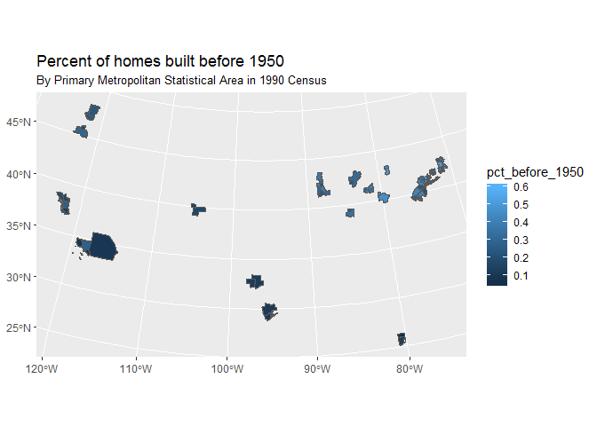

<!-- README.md is generated from README.Rmd. Please edit that file -->
ripums
======

The ripums package helps import IPUMS extracts from the [IPUMS website](https://www.ipums.org) into R. This project is early in its development, and so we expect there may be bugs and future API changes that break code. We hope to post a more stable version on CRAN soon.

The ripums package can be installed by running the following commands:

``` r
if (!require(devtools)) install.packages("devtools")

devtools::install_github("mnpopcenter/ripums")

# MPC staff can install using local files 
if (Sys.info()["sysname"] == "Windows") {
  devtools::install_local("Z:/personal/gfellis/ripums")
} else {
  devtools::install_local("/pkg/ipums/personal/gfellis/ripums")
}
```

Examples
--------

Example extracts are included in the 'ripumstest' package, which can be installed using the following comands:

``` r
devtools::install_github("mnpopcenter/ripumstest")

# MPC staff can install using local files 
if (Sys.info()["sysname"] == "Windows") {
  devtools::install_local("Z:/personal/gfellis/ripumstest")
} else {
  devtools::install_local("/pkg/ipums/personal/gfellis/ripumstest")
}
```

``` r
suppressPackageStartupMessages({
  library(ripums)
  library(haven)
  library(ggplot2) # ggplot2 version > 2.2.1 (development version as of 8/15/2017)
  library(dplyr)
  library(sf)
})
```

### CPS - Hierarchical Data

Relies on user downloading the .xml DDI file and the .dat/.dat.gz file (doesn't need to be unzipped).

``` r
# Use example file included with package:
cps_hier_file <- ripums_example("cps_00010.xml")
ddi <- read_ipums_ddi(cps_hier_file)
data <- read_ipums_micro(ddi)
#> Users of IPUMS-CPS data must agree to abide by the conditions of use. A user's license is valid for one year and may be renewed.  Users must agree to the following conditions:
#> 
#> (1) No fees may be charged for use or distribution of the data.  All persons are granted a limited license to use these data, but you may not charge a fee for the data if you distribute it to others.
#> 
#> (2) Cite IPUMS appropriately.  For information on proper citation,  refer to the citation requirement section of this DDI document.
#> 
#> (3) Tell us about any work you do using the IPUMS.  Publications, research  reports, or presentations making use of IPUMS-CPS should be added to our  Bibliography. Continued funding for the IPUMS depends on our ability to  show our sponsor agencies that researchers are using the data for productive  purposes.
#> 
#> (4) Use it for GOOD -- never for EVIL.
#> 
#> Publications and research reports based on the IPUMS-CPS database must cite it appropriately. The citation should include the following:
#> 
#> Sarah Flood, Miriam King, Steven Ruggles, and J. Robert Warren. Integrated Public Use Microdata Series, Current Population Survey: Version 5.0 [dataset]. Minneapolis, MN: University of Minnesota, 2017. https://doi.org/10.18128/D030.V5.0
#> 
#> The licensing agreement for use of IPUMS-CPS data requires that users supply us with the title and full citation for any publications, research reports, or educational materials making use of the data or documentation. Please add your citation to the IPUMS bibliography: http://bibliography.ipums.org/
#> 
#> Reading data...
#> Parsing data...

# Variable description for the month variable
cat(ipums_var_desc(ddi, MONTH))
#> MONTH indicates the calendar month of the CPS interview.

# Hierarachical data loaded as a list by rectype by default
# Household data
data$H
#> # A tibble: 3,385 x 5
#>     YEAR SERIAL HWTSUPP  STATEFIP     MONTH
#>    <dbl>  <dbl>   <dbl> <dbl+lbl> <dbl+lbl>
#>  1  1962     80 1475.59        55         3
#>  2  1962     82 1597.61        27         3
#>  3  1962     83 1706.65        27         3
#>  4  1962     84 1790.25        27         3
#>  5  1962    107 4355.40        19         3
#>  6  1962    108 1479.05        19         3
#>  7  1962    122 3602.75        27         3
#>  8  1962    124 4104.41        55         3
#>  9  1962    125 2182.17        55         3
#> 10  1962    126 1826.38        55         3
#> # ... with 3,375 more rows

# Value labels loaded as haven::labelled class
# Convert to factors with `as_factor`
table(as_factor(data$H$MONTH, levels = "both"))
#> 
#>   [1] January  [2] February     [3] March     [4] April       [5] May 
#>             0             0          3385             0             0 
#>      [6] June      [7] July    [8] August [9] September  [10] October 
#>             0             0             0             0             0 
#> [11] November [12] December 
#>             0             0
```

### CPS - Rectangular Data

Relies on user downloading the .xml DDI file and the .dat/.dat.gz file (doesn't need to be unzipped).

``` r
# Use example file included with package
cps_rect_file <- ripums_example("cps_00006.xml")
data <- read_ipums_micro(cps_rect_file, verbose = FALSE)

# While working interactively, can get convenient display of variable information
# in RStudio's viewer
ipums_view(data)
```

### NHGIS

Relies on user downloading the csv file (with or without header row) and shape files (doesn't need to be unzipped).

Note that to save space when including this data on CRAN, the shape file has been reduced to squares around the centroid of the PMSA. The original shape file can be found in the `ripumstest` package.

``` r
data <- read_nhgis_sf(
  ripums_example("nhgis0008_csv.zip"),
  shape_file = ripums_example("nhgis0008_shape_small.zip"),
  verbose = FALSE
)

ipums_var_info(data, starts_with("D6Z"))
#> # A tibble: 8 x 4
#>   var_name          var_label                   var_desc       val_labels
#>      <chr>              <chr>                      <chr>           <list>
#> 1   D6Z001 1989 to March 1990 Year Structure Built (D6Z) <tibble [0 x 2]>
#> 2   D6Z002       1985 to 1988 Year Structure Built (D6Z) <tibble [0 x 2]>
#> 3   D6Z003       1980 to 1984 Year Structure Built (D6Z) <tibble [0 x 2]>
#> 4   D6Z004       1970 to 1979 Year Structure Built (D6Z) <tibble [0 x 2]>
#> 5   D6Z005       1960 to 1969 Year Structure Built (D6Z) <tibble [0 x 2]>
#> 6   D6Z006       1950 to 1959 Year Structure Built (D6Z) <tibble [0 x 2]>
#> 7   D6Z007       1940 to 1949 Year Structure Built (D6Z) <tibble [0 x 2]>
#> 8   D6Z008    1939 or earlier Year Structure Built (D6Z) <tibble [0 x 2]>

data <- data %>%
  mutate(
    pct_before_1950 = (D6Z007 + D6Z008) / 
           (D6Z001 + D6Z002 + D6Z003 + D6Z004 + D6Z005 + D6Z006 + D6Z007 + D6Z008)
  )

ggplot(data = data) + 
  geom_sf(aes(fill = pct_before_1950)) + 
  labs(
    title = "Percent of homes built before 1950", 
    subtitle = "By Primary Metropolitan Statistical Area in 1990 Census", 
    caption = "Simplified PMSA boundaries (squares around centroid)"
  )
```



### Terrapop

There is experimental support for for loading terrapop data, but examples are too large to include in the package.

``` r
# Raster data
data <- ripums:::read_terra_raster(
  "2552_bundle.zip",
  "CROPLAND2000ZM2013.tiff",
  verbose = FALSE
)

# Area data
data <- ripums:::read_terra_area(
  "2553_bundle.zip",
  verbose = FALSE
)

# Microdata
data <- ripums:::read_terra_micro(
  "2554_bundle.zip",
  verbose = FALSE
)
```
