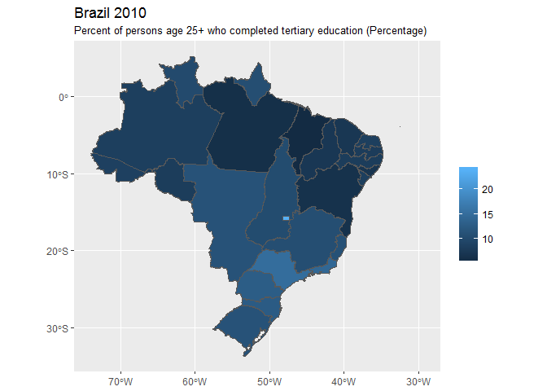

<!-- README.md is generated from README.Rmd. Please edit that file -->
ipumsimport
===========

The ipumsimport package helps import IPUMS extracts from the [IPUMS website](https://www.ipums.org) into R.

It can be installed by running the following commands:

``` r
if (!require(devtools)) install.packages("devtools")

if (Sys.info()$sysname == "Windows") {
  devtools::install_local("Z:/personal/gfellis/ipumsimport")
} else {
  devtools::install_local("/pkg/ipums/personal/gfellis/ipumsimport")
}
```

Examples
--------

``` r
library(ipumsimport)
library(mpctools)
library(haven)
library(ggplot2)
library(dplyr)
#> 
#> Attaching package: 'dplyr'
#> The following objects are masked from 'package:stats':
#> 
#>     filter, lag
#> The following objects are masked from 'package:base':
#> 
#>     intersect, setdiff, setequal, union
```

### CPS - Hierarchical Data

Relies on user downloading the .xml DDI file and the .dat/.dat.gz file (doesn't need to be unzipped).

``` r
data <- read_ipums_micro(mpc_root("personal/gfellis/ipumsimport_examples/cps_hier/cps_00004.xml"))
#> Users of IPUMS-CPS data must agree to abide by the conditions of use. A user's license is valid for one year and may be renewed.  Users must agree to the following conditions:
#> 
#> (1) No fees may be charged for use or distribution of the data.  All persons are granted a limited license to use these data, but you may not charge a fee for the data if you distribute it to others.
#> 
#> (2) Cite IPUMS appropriately.  For information on proper citation,  refer to the citation requirement section of this DDI document.
#> 
#> (3) Tell us about any work you do using the IPUMS.  Publications, research  reports, or presentations making use of IPUMS-CPS should be added to our  Bibliography. Continued funding for the IPUMS depends on our ability to  show our sponsor agencies that researchers are using the data for productive  purposes.
#> 
#> (4) Use it for GOOD -- never for EVIL.
#> 
#> Publications and research reports based on the IPUMS-CPS database must cite it appropriately. The citation should include the following:
#> 
#> Sarah Flood, Miriam King, Steven Ruggles, and J. Robert Warren. Integrated Public Use Microdata Series, Current Population Survey: Version 5.0 [dataset]. Minneapolis, MN: University of Minnesota, 2017. https://doi.org/10.18128/D030.V5.0
#> 
#> The licensing agreement for use of IPUMS-CPS data requires that users supply us with the title and full citation for any publications, research reports, or educational materials making use of the data or documentation. Please add your citation to the IPUMS bibliography: http://bibliography.ipums.org/
#> 
#> Reading data...
#> Parsing data...

cat(ip_var_label_long(data, TCIG100))
#> TCIG100 identifies individuals who had ever smoked 100 cigarettes in their lifetime.
#> 
#> This variable is part of the Tobacco Use Supplement [URL omitted from DDI.].
table(as_factor(data$TCIG100, levels = "both"))
#> 
#>           [1] No          [2] Yes     [96] Refused  [97] Don't know 
#>            53070            25674               87              288 
#> [98] No Response         [99] NIU 
#>                3            54471
```

### CPS - Rectangular Data

Relies on user downloading the .xml DDI file and the .dat/.dat.gz file (doesn't need to be unzipped).

``` r
data <- read_ipums_micro(mpc_root("personal/gfellis/ipumsimport_examples/cps_rect/cps_00003.xml"), verbose = FALSE)

cat(ip_var_label_long(data, TCIG100))
#> TCIG100 identifies individuals who had ever smoked 100 cigarettes in their lifetime.
#> 
#> This variable is part of the Tobacco Use Supplement [URL omitted from DDI.].
table(as_factor(data$TCIG100, levels = "both"))
#> 
#>           [1] No          [2] Yes     [96] Refused  [97] Don't know 
#>            53070            25674               87              288 
#> [98] No Response         [99] NIU 
#>                3            54471
```

### NHGIS

Relies on user downloading the csv file (with or without header row) and shape files (doesn't need to be unzipped).

``` r
data <- read_nhgis(
  mpc_root("personal/gfellis/ipumsimport_examples/nhgis/nhgis0005_csv.zip"),
  mpc_root("personal/gfellis/ipumsimport_examples/nhgis/nhgis0005_shape.zip"),
  "state",
  "state",
  verbose = FALSE
)

data <- data %>%
  mutate(pct_slave = (ABO003 + ABO004) / (ABO001 + ABO002 + ABO003 + ABO004 + ABO005 + ABO006))

ggplot(data = data) + 
  geom_sf(aes(fill = pct_slave))
```


### Terrapop - Raster Data

Relies on zip file from extract

``` r
data <- read_terra_raster(
  mpc_root("personal/gfellis/ipumsimport_examples/terra_raster/2552_bundle.zip"),
  "CROPLAND2000ZM2013",
  verbose = FALSE
)

raster::plot(data)
```


``` r

# Or can read multiple rasters into a list
data <- read_terra_raster_list(
  mpc_root("personal/gfellis/ipumsimport_examples/terra_raster/2552_bundle.zip"),
  verbose = FALSE
)

names(data) %>% head()
#> [1] "PASTURE2000ZM2013"  "PASTURE2000CH2013"  "CROPLAND2000ZM2013"
#> [4] "CROPLAND2000CH2013" "LCDECIDOPZM2013"    "LCDECIDOPCH2013"
```

### Terrapop - Area level data

Relies on usual extract (with boundary files for maps) either zipped or unzipped

``` r
data <- read_terra_area(
  mpc_root("personal/gfellis/ipumsimport_examples/terra_area/2553_bundle.zip"),
  verbose = FALSE
)

var_label <- ip_var_label(data, EDUCTERTIARY_GEO1_BR_BR2010A)
var_label
#> [1] "Percent of persons age 25+ who completed tertiary education (Percentage)"

ggplot(data) +
  geom_sf(aes(fill = EDUCTERTIARY_GEO1_BR_BR2010A)) + 
  scale_fill_continuous("") + 
  ggtitle("Brazil 2010", subtitle = var_label)
```



``` r
data <- read_terra_area(
  mpc_root("personal/gfellis/ipumsimport_examples/terra_area/2644_bundle.zip"),
  data_layer = "DZ",
  verbose = FALSE
)

data
#> Simple feature collection with 48 features and 5 fields
#> geometry type:  MULTIPOLYGON
#> dimension:      XY
#> bbox:           xmin: -8.673868 ymin: 18.96003 xmax: 11.98891 ymax: 37.09514
#> epsg (SRID):    4326
#> proj4string:    +proj=longlat +datum=WGS84 +no_defs
#> # A tibble: 48 x 6
#>             LABEL GEOID TOTPOP_DZ_FLAD_DZ08_TP
#>             <chr> <dbl>                  <dbl>
#>  1 Oum el Bouaghi   374                 621611
#>  2          Jijel   363                 636950
#>  3         Illizi   362                  52332
#>  4       Relizane   375                 726180
#>  5 Sidi Bel Abbès   378                 604745
#>  6          Sétif   377                1489985
#>  7          Saïda   376                 330642
#>  8         Guelma   361                 482427
#>  9         Annaba   345                 609499
#> 10          Alger   344                2988146
#> # ... with 38 more rows, and 3 more variables:
#> #   FIGHAR_total_area_areal_DZ_FLAD_GLICROPS <dbl>,
#> #   FIGHAR_percent_area_areal_DZ_FLAD_GLICROPS <dbl>, geometry <S3:
#> #   sfc_MULTIPOLYGON>
```

### Terrapop - Microlevel data

Relies on usual extract file (with boundary files for maps) either zipped or unzipped This file is huge, so won't run on a local machine, but I need IT's help getting some dependcies set-up to run this on the mpcstats servers.
