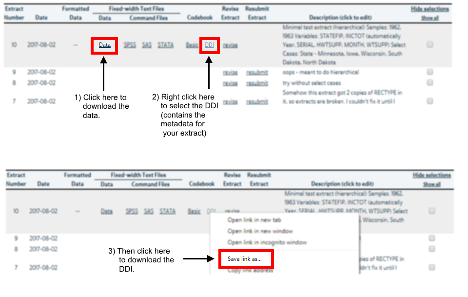

```{r setup, include = FALSE}
knitr::opts_chunk$set(
  collapse = TRUE,
  comment = "#>"
)
```

The `ipumsr` package allows you to read in data from your extract into R along with 
the associated metadata like variable labels, value labels and more. IPUMS 
is a great source of international census and survey data.

> IPUMS provides census and survey data from around the world integrated across 
> time and space. IPUMS integration and documentation makes it easy to study change, 
> conduct comparative research, merge information across data types, and analyze 
> individuals within family and community context. Data and services are available free 
> of charge. 

Learn more here: <https://www.ipums.org/whatIsIPUMS.shtml>

# Basics
This vignette gives the basic outline of the `ipumsr` package. There are also
vignettes that show how to use the value labels and geographic data provided by IPUMS
and others that run through examples using CPS data and NHGIS data. 

To get to them run the following commands:
```{r, eval = FALSE}
vignette("value-labels", package = "ipumsr")
vignette("ipums-geography", package = "ipumsr")
vignette("ipums-cps", package = "ipumsr")
vignette("ipums-nhgis", package = "ipumsr")
vignette("ipums-terra", package = "ipumsr")
```

## Getting Data from the IPUMS website
IPUMS data is downloaded from our website at <https://www.ipums.org>. 
The website provides an interactive extract system that allows you to select
only the sample and variables that are relevant to your research question.

Currently we do not support the TerraPop, but we hope to add support soon!

**For microdata projects (all supported projects except NHGIS and IPUMS Terra)**, once you 
have created your extract, you should choose to download data as either 
fixed-width-files or comma separated ones. 

Once your extract is complete, download the data file (.dat or .csv) and the
DDI. Downloading the DDI is a little bit different depending on your computer.
On most browsers you should right-click the file and select "Save As...".
If this saves a ".xml" file, then you should be ready. However, Safari users
must select "Download Linked File" instead of "Download Linked File **As**". On
Safari, selecting the wrong version of these two will download an ".html" file
instead of a ".xml" one.

{ width=700px }

**For NHGIS**, download the table data as a csv, and, if you want 
the associated mapping data, the GIS data. NHGIS provides the option to download 
csvs with an extra header row, it does not matter which option you select.

**For IPUMS Terra**, download the .zip extract "bundles". If you want the associated 
mapping data, select the "include boundary files" option. You do not need to unzip
the data.

## Import Functions
Once your extract is downloaded, the `ipumsr` package functions `read_*()`
help you load the data into R. 

- `read_ipums_micro()` / `read_ipums_micro_list()`: Reads data from microdata projects (USA, CPS, International, DHS, Time Use, Health Surveys and Higher Ed)
- `read_nhgis()` / `read_nhgis_sf()` / `read_nhgis_sp()`: Reads data from the NHGIS project. `read_nhgis` loads only tabular data, whereas `read_nhgis_sf()` and `read_nhgis_sp()` load tabular data and shapefiles.
- `read_terra_micro()`, `read_terra_micro_sf()`, `read_terra_micro_sp()`, `read_terra_area()` and `read_terra_raster()` load
data form the IPUMS Terra project.
- `read_ipums_sf()` and `read_ipums_sp()` load boundary files.
- `read_ipums_ddi()`: Reads DDI files with metadata that are included alongside some extracts (mainly microdata)
- `read_ipums_codebook()`: Reads the text codebook included alongside some extracts (mainly NHGIS and some TerraPop extracts)

## Metadata Functions
Once the data is into R, you can learn information about the extract using the metadata function.

- `ipums_view()`: Makes a webpage that displays in the Rstudio Viewer which provides information about the extract as a whole (like your extract notes or the citation information) and the specific variables included (like the variable label, description and value labels).
- `ipums_file_info()`: Returns the file-level metadata contained in `ipums_view()` but as a R data structure.
- `ipums_var_info()`: Returns the variable-level metadata contained in `ipums_view()` but as a R data structure.

## Grab Bag
### Survey Weights
The data from most projects contain some form of weighting variable that should be used to 
calculate estimates that are representative of the whole population. Many projects also provide 
specifications to help estimate variance given the complex design of the survey, such as replicate
weights or design variables like STRATUM and PSU. The 
[survey package](https://cran.r-project.org/package=survey) provides functions that allow you to 
estimate variance taking this into account, and the [srvyr package](https://cran.r-project.org/package=srvyr)
implements dplyr-like syntax for survey analysis, using the survey package's functions. 

For more information about what these variables mean and how to use them, see the 
website for the project you are interested in.

### Non-Extract Data
Some projects have data that is not contained within the extract system and so no DDI is provided
for this data. In this case, either use the csv if available, or the haven package to read one
of the files intended for another statistical software (like Stata, SAS or SPSS). 

### Value Labels
The way that IPUMS treats value labels does not align with factors (the main way that R is able
to store values associated with labels). R's `factor` variables can only store
values as an integer sequence (1, 2, 3, ...), but IPUMS conventions are to store 
missing / not in universe codes as large numbers, to distinguish them from the normal values.

Therefore, the `ipumsr` package uses the `labelled` class from the `haven` package to store
labelled values. See the "value-labels" vignette for more information 
(`vignette('value-labels')`).

In summary, it is generally best if you wish to use the labels, to convert from
the `labelled` class to `factor` early on in data analysis workflow. This is
because many data manipulation functions will lose the associated labels. The
function `as_factor()` is the main function to create factors from labels, but 
often you will need to do more manipulation before that.

```{r}
library(ipumsr)
library(dplyr, warn.conflicts = FALSE)

# Note that you can pass in the loaded DDI into the `read_ipums_micro()`
cps_ddi <- read_ipums_ddi(ipums_example("cps_00006.xml"))
cps_data <- read_ipums_micro(cps_ddi, verbose = FALSE)

# Show which variables have labels
cps_data %>%
  select_if(is.labelled)

# Notice how the tibble print function shows the dbl+lbl class on top

# Investigate labels
ipums_val_labels(cps_data$STATEFIP)

# Convert the labels to factors (and drop the unused levels)
cps_data <- cps_data %>%
  mutate(STATE_factor = as_factor(lbl_clean(STATEFIP)))

table(cps_data$STATE_factor, useNA = "always")
```
```{r, error = TRUE}
# Manipulating the labelled value before as_factor 
# often leads to losing the information...
# Say we want to set Iowa (STATEFIP == 19) to missing
cps_data <- cps_data %>%
  mutate(STATE_factor2 = as_factor(ifelse(STATEFIP == 19, NA, STATEFIP)))
```
```{r}
# ipumsr provides helpers for these kinds of tasks, like lbl_na_if().
# See the value-labels vignette for more information
cps_data <- cps_data %>%
  mutate(STATE_factor3 = as_factor(lbl_na_if(STATEFIP, ~.val == 19)))

# The as_factor function also has a "levels" argument that can 
# put both the labels and values into the factor
cps_data <- cps_data %>%
  mutate(STATE_factor4 = droplevels(as_factor(STATEFIP, levels = "both")))

table(cps_data$STATE_factor4, useNA = "always")

```

### Other IPUMS attributes
Similarly, the other attributes that `ipumsr` stores about the data are often lost
during an analysis. One way to deal with this is to load the DDI or codebook in addition
to the actual data using the functions `read_ipums_ddi()` and `read_ipums_codebook()`. This
way, when you wish to refer to variable labels or other metadata, you can use the 
DDI object, which does not get modified during your analysis.

```{r}
library(ipumsr)
library(dplyr, warn.conflicts = FALSE)

# Note that you can pass in the loaded DDI into the `read_ipums_micro()`
cps_ddi <- read_ipums_ddi(ipums_example("cps_00006.xml"))
cps_data <- read_ipums_micro(cps_ddi, verbose = FALSE)

# Currently variable description is available for year
ipums_var_desc(cps_data$YEAR)

# But after using ifelse it is gone
cps_data <- cps_data %>%
  mutate(YEAR = ifelse(YEAR == 1962, 62, NA))
ipums_var_desc(cps_data$YEAR)

# So you can use the DDI
ipums_var_desc(cps_ddi, "YEAR")

# The DDI also has file level information that is not available from just
# the data.
ipums_file_info(cps_ddi, "extract_notes")
```

### "dplyr select-style" Syntax
Several functions within the `ipumsr` package allow for "dplyr select-style" syntax.
This means that they accept either a character vector of values (eg `c("YEAR", "AGE")`), 
bare vectors of values (eg `c(YEAR, AGE)`) and the helper functions allowed in 
`dplyr::select()` (eg `one_of(c("YEAR", "AGE"))`).

```{r}
library(ipumsr)
library(dplyr, warn.conflicts = FALSE)

# The vars argument for `read_ipums_micro` uses this syntax
# So these are all equivalent
cf <- ipums_example("cps_00006.xml")
read_ipums_micro(cf, vars = c("YEAR", "INCTOT"), verbose = FALSE) %>%
  names()

read_ipums_micro(cf, vars = c(YEAR, INCTOT), verbose = FALSE) %>%
  names()

read_ipums_micro(cf, vars = c(one_of("YEAR"), starts_with("INC")), verbose = FALSE) %>%
  names()

# `data_layer` and `shape_layer` arguments to `read_nhgis()` and terra functions
# also use it.
# (Sometimes extracts have multiple files, though all examples only have one)
nf <- ipums_example("nhgis0008_csv.zip")
ipums_list_files(nf)

ipums_list_files(nf, data_layer = "nhgis0008_csv/nhgis0008_ds135_1990_pmsa.csv")

ipums_list_files(nf, data_layer = contains("ds135"))
```

### Hierarchical data structures
For certain IPUMS projects, the data is hierarchical, multiple people are 
included in a single household, or multiple activities are performed by
a single person. The `ipumsr` package provides two data structures for
storing such data (for users who did not select the "rectangularize" option
on the website). The data can be loaded as a `"list"` or `"long"`. 

**List** data loads each record type into a separate data.frame. The names 
of the recordtype data.frames are the value of the RECTYPE variable (eg "H" 
and "P"). Use the function `read_ipums_micro_list()` to load the data
this way.

**Long** data has one row per unit, regardless of what type of record the unit is.
Therefore, datasets loaded this way often contain variables with a large 
number of missings, for the variables that only apply to certain record types. 
Use the function `read_ipums_micro()` to load the data this way.
```{r}
library(ipumsr)
library(dplyr, warn.conflicts = FALSE)

# List data
cps <- read_ipums_micro_list(
  ipums_example("cps_00010.xml"),
  verbose = FALSE
)

cps$PERSON

cps$HOUSEHOLD

# Long data
cps <- read_ipums_micro(
  ipums_example("cps_00010.xml"),
  verbose = FALSE
)

cps
```

### Geospatial Packages: `sf` vs `sp`
The `ipumsr` package allows for loading geospatial data in two formats (sf for
Simple Features and sp for Spatial). The `sf` package is relatively new, and so 
does not have as widespread support as the `sp` package. However, (in my opinion)
it does allow for easier analysis, and so may be a better place to start if you
have not used GIS data in R before.

For more details about how to load geographic data using ipumsr, see the vignette
"ipums-geography" (`vignette("ipums-geography", package = "ipumsr")`)
